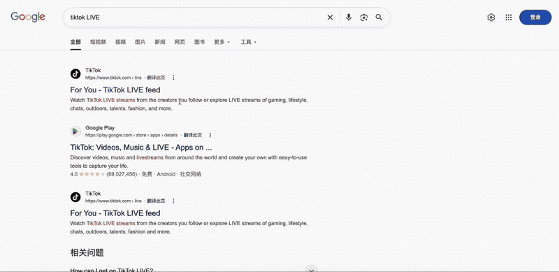
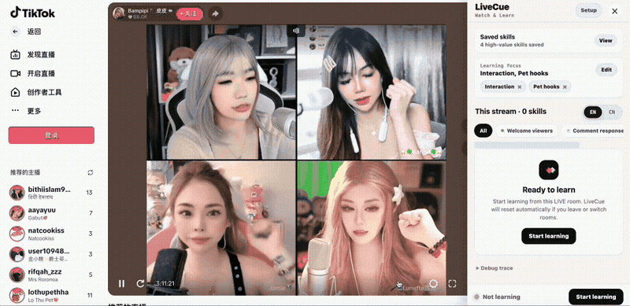
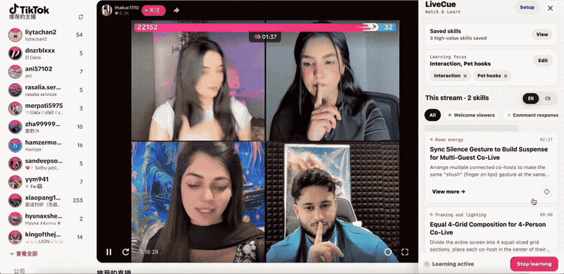
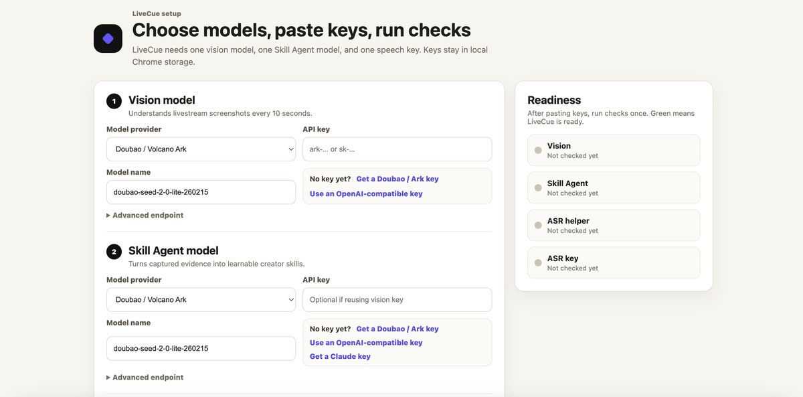

# LiveCue

**AI watch-and-learn copilot for TikTok LIVE creators.**

LiveCue is an AI-powered learning tool for livestreams, currently built for TikTok LIVE. It summarizes creator skills in real time while you watch, turning every LIVE room into a learning session.

LiveCue adds a learning panel to the livestream page. It uses public room signals, visible comments, livestream visuals, and page audio, then calls your own configured model/API keys to generate learnable creator skill cards.

**直播创作者的 AI 看播学习助手。**

LiveCue 是一个 AI 赋能的直播学习工具，目前支持 TikTok LIVE。它会在你观看直播时，实时总结主播的直播技巧，让每一次看播都变成一次有效学习。

LiveCue 会在直播页面侧边显示一个学习面板，基于公开直播间信号、可见评论、直播画面和音频，使用你自己配置的模型/API Key，生成可学习的主播技巧卡片。

## Why I Built This / 为什么做 LiveCue

LiveCue is an independent open-source project built by a TikTok LIVE product manager. It is not affiliated with TikTok. I built it because I wanted a faster way to learn from great livestream creators: not just watching what happened, but turning good moments into reusable creator skills.

LiveCue 是一个独立开源项目，由一名 TikTok LIVE 产品经理开发，并非 TikTok 官方项目。我做它是因为我希望更高效地从优秀直播间中学习：不只是看见发生了什么，而是把好的直播瞬间转化成可复用的主播技巧。

## Download / 下载

[Download LiveCue public v1.0.0](https://github.com/summer202007/LIVECue_ai/releases/latest/download/LiveCue-public-v1.0.0.zip)

[下载 LiveCue public v1.0.0](https://github.com/summer202007/LIVECue_ai/releases/latest/download/LiveCue-public-v1.0.0.zip)

## Why LiveCue / 为什么用 LiveCue

- Watch TikTok LIVE rooms and extract creator skills in real time.
- Learn from visible comments, livestream visuals, page audio, and room interactions.
- Save useful skills into your own local learning library.
- BYOK: bring your own model/API keys. Your keys stay local.

- 观看 TikTok LIVE 时，实时提炼主播可学习的直播技巧。
- 从可见评论、直播画面、页面音频和直播间互动里学习。
- 把有价值的技巧收藏起来，沉淀自己的本地学习库。
- BYOK：使用你自己的模型/API Key，Key 保存在本地。

## See It In Action / 使用演示

**1. Works automatically on TikTok pages**  
**1. 在 TikTok 域名下自动生效**



**2. Start once, keep learning continuously**  
**2. 一键开启，持续学习**



**3. Save useful skills and build your learning library**  
**3. 支持收藏，沉淀知识库**



**4. Configure your own API keys visually**  
**4. 可视化配置 API Key**



## Quick Start / 快速开始

1. Download the latest release zip.
2. Load `livecue-extension` in `chrome://extensions`.
3. Start the local ASR relay.
4. Configure your model/API keys and run readiness checks.
5. Open a TikTok LIVE room and click `Start learning`.

1. 下载最新 release zip。
2. 在 `chrome://extensions` 里加载 `livecue-extension`。
3. 启动本地 ASR relay。
4. 配置模型/API Key，并运行红绿灯检查。
5. 打开一个 TikTok LIVE 直播间，点击 `Start learning`。

For screenshots and full installation steps, see [docs/INSTALL.md](docs/INSTALL.md).

完整截图版安装说明请看 [docs/INSTALL.md](docs/INSTALL.md)。

## What LiveCue Learns From / LiveCue 会学习什么

- Public room signals.
- Visible comments.
- Livestream visuals.
- Page audio and ASR transcripts.
- Room interactions such as cohost/multiguest/PK signals when available.

- 公开直播间信号。
- 可见评论。
- 直播画面。
- 页面音频和 ASR 转写。
- 可获取时，也会读取 cohost、multiguest、PK 等直播间互动信号。

## For Developers / 开发者

Useful docs:

开发者文档：

- `docs/DEVELOPMENT.md`
- `docs/ARCHITECTURE.md`
- `docs/TROUBLESHOOTING.md`
- `PRIVACY.md`
- `SECURITY.md`
- `CONTRIBUTING.md`

Build a public release zip:

构建公开发布包：

```bash
node scripts/build-release.mjs --version 1.0.0
```

Optional relay health check:

可选 relay 健康检查：

```bash
node scripts/build-release.mjs --version 1.0.0 --health-check
```

## Privacy / 隐私

LiveCue is BYOK: bring your own model/API keys. API keys are stored in local Chrome storage. The release package does not include private API keys.

LiveCue 是 BYOK 工具：使用你自己的模型/API Key。API Key 会保存在本地 Chrome storage 中。发布包不包含任何私有 API Key。

## Docs / 文档

- [Installation Guide](docs/INSTALL.md)
- [Troubleshooting](docs/TROUBLESHOOTING.md)
- [Privacy](PRIVACY.md)
- [Security](SECURITY.md)
- [Contributing](CONTRIBUTING.md)

- [安装说明](docs/INSTALL.md)
- [故障排查](docs/TROUBLESHOOTING.md)
- [隐私说明](PRIVACY.md)
- [安全说明](SECURITY.md)
- [参与贡献](CONTRIBUTING.md)

## Roadmap / 路线图

- Chrome Web Store release.
- Easier local ASR helper with less terminal setup.
- More ASR and model providers.
- Better multilingual skill cards.
- Creator learning library export.
- Mobile LIVE learning concept.

- 发布到 Chrome Web Store。
- 降低本地 ASR helper 的启动门槛，减少终端操作。
- 支持更多 ASR 和模型 provider。
- 优化多语言技巧卡片。
- 支持导出主播学习知识库。
- 探索移动端直播学习体验。

## Known Limitations / 已知限制

- Node.js is required because v1.0.0 does not include a native helper app.
- Windows support is theoretical and not fully verified yet.
- Users must bring their own model and ASR API keys.
- TikTok page changes may affect extraction quality.
- The local ASR relay terminal/command window must stay open while learning.

- 当前 v1.0.0 还没有 native helper app，因此需要 Node.js。
- Windows 当前是理论可用，还没有完整实测。
- 用户需要自己提供模型和 ASR API Key。
- TikTok 页面变化可能影响采集质量。
- 学习过程中，本地 ASR relay 的 Terminal/命令行窗口需要保持打开。
