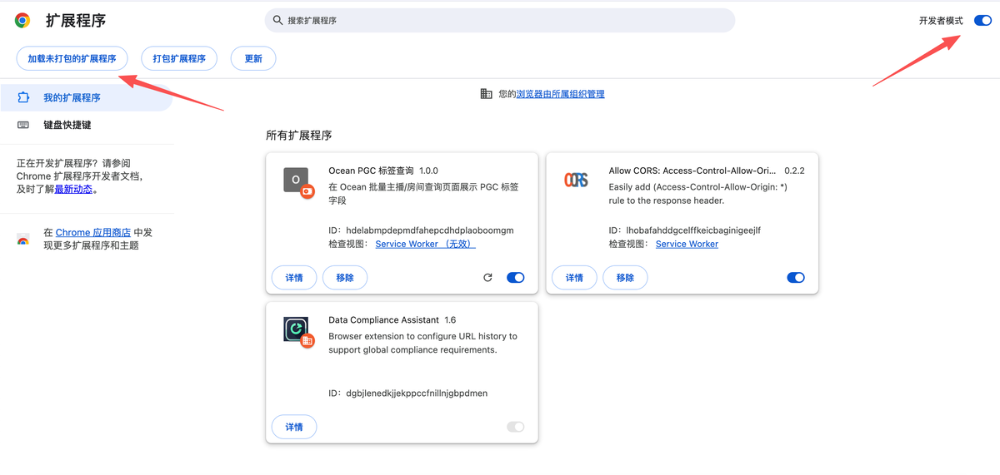
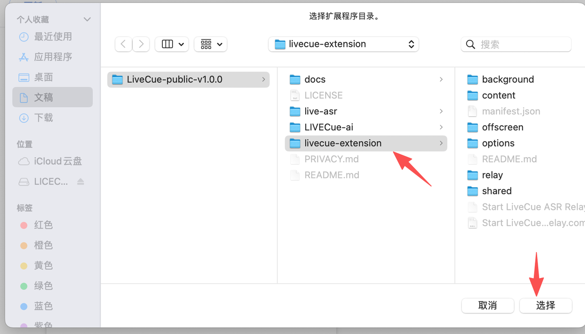

# LiveCue Installation Guide

This guide walks through installing LiveCue from the public release package.

本文档会一步步说明如何从公开 release 包安装 LiveCue。

## Requirements / 使用前准备

- Chrome.
- Node.js 20 or newer. Download it from https://nodejs.org/. The local ASR relay uses Node.js.
- macOS is tested. Windows is theoretically supported with the `.bat` relay script, but not fully verified yet.
- Your own model/API keys for vision, Skill Agent, and Volcengine ASR.

- Chrome 浏览器。
- Node.js 20 或更高版本。可以从 https://nodejs.org/ 下载。本地 ASR relay 需要 Node.js。
- macOS 已测试。Windows 已提供 `.bat` relay 启动脚本，理论可用，但还没有完整实测。
- 你自己的视觉模型、Skill Agent 模型和 Volcengine ASR API Key。

## 1. Download and unzip / 下载并解压

Download the latest release:

下载最新 release：

```text
https://github.com/summer202007/LIVECue_ai/releases/latest/download/LiveCue-public-v1.0.0.zip
```

Unzip `LiveCue-public-v1.0.0.zip`. You should see:

解压 `LiveCue-public-v1.0.0.zip`，你会看到：

```text
LiveCue-public-v1.0.0/
  README.md
  docs/
  livecue-extension/
  live-asr/
```

## 2. Install the Chrome extension / 安装 Chrome 插件

Open Chrome and go to:

打开 Chrome，进入：

```text
chrome://extensions
```

Turn on `Developer mode`.

打开 `Developer mode / 开发者模式`。

Click `Load unpacked`.

点击 `Load unpacked / 加载已解压的扩展程序`。



Select this folder:

选择这个文件夹：

```text
LiveCue-public-v1.0.0/livecue-extension
```



## 3. Start the local ASR relay / 启动本地 ASR Relay

Open this folder:

打开这个文件夹：

```text
LiveCue-public-v1.0.0/livecue-extension
```

On macOS, double-click:

macOS 用户双击：

```text
Start LiveCue ASR Relay.command
```

On Windows, double-click:

Windows 用户双击：

```text
Start LiveCue ASR Relay.bat
```

If it works, Terminal will open and show:

如果成功，macOS 会打开 Terminal，Windows 会打开命令行窗口，并显示：

```text
LiveCue ASR relay listening on http://127.0.0.1:17395/asr
```

Keep this Terminal window open while using LiveCue.

使用 LiveCue 时，请保持这个 Terminal 窗口打开。

If macOS blocks the script, open the LiveCue Setup page, copy the fallback relay command, paste it into Terminal, choose `Start LiveCue ASR Relay.command`, and press Enter.

如果 macOS 拦截脚本，请打开 LiveCue Setup 页面，复制 fallback relay command，粘贴到 Terminal，选择 `Start LiveCue ASR Relay.command`，然后回车。

## 4. Configure API keys / 配置 API Key

After installing the extension, the LiveCue Setup page should open automatically. You can also click the Chrome extension icon to open it.

插件安装后会自动打开 LiveCue Setup 页面。你也可以点击 Chrome 插件图标打开。

Fill in:

填写：

```text
Vision model API key
Skill Agent model API key
Volcengine ASR API key
```

Then click:

然后点击：

```text
Save & run checks
```

Wait for the readiness checks to turn green.

等待红绿灯检查通过。

Success means:

成功状态是：

```text
Vision: green
Skill Agent: green
ASR helper: green
ASR key: configured
```

## 5. Start learning / 开始学习

Click:

点击：

```text
Open TikTok LIVE
```

Open a specific TikTok LIVE room.

进入一个具体的 TikTok LIVE 直播间。

The LiveCue panel will appear on the right. Click:

右侧会出现 LiveCue 面板，点击：

```text
Start learning
```

Wait for about one minute. LiveCue will start generating learnable creator skill cards.

等待大约 1 分钟，LiveCue 会开始生成可学习的主播技巧卡片。

If something does not work, open [TROUBLESHOOTING.md](TROUBLESHOOTING.md).

如果遇到问题，请先打开 [TROUBLESHOOTING.md](TROUBLESHOOTING.md)。
